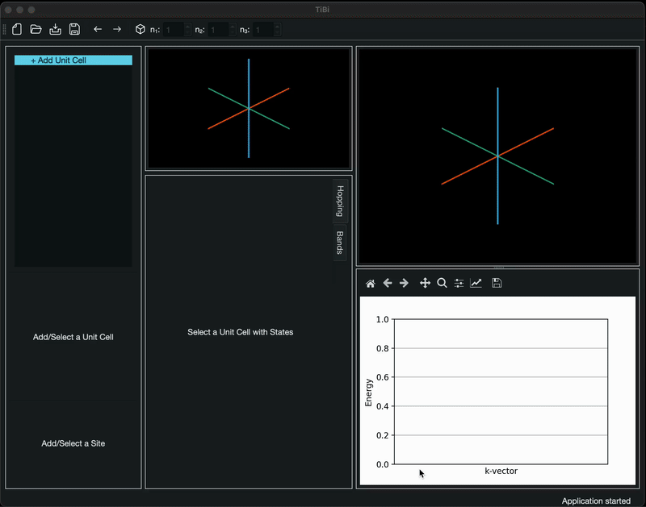

# TiBi

Welcome! 

TiBi is an app that performs **Ti**ght **Bi**nding calculations. It allows the User to construct the system using graphical means with no coding.

Please consult the [documentation](https://rodinalex.github.io/TiBi/) on how to set up TiBi on your machine and how to use the application.

---

## Supported Platforms

- ✅ macOS (Apple Silicon & Intel): binary available
- ✅ Windows (in progress)
- ✅ Linux

---

## Troubleshooting

### Common Issues

**"Module not found" errors:**
- Ensure your virtual environment is activated
- Try reinstalling dependencies: `pip install -r requirements.txt --upgrade`

**PyInstaller build fails:**
- Check that you're using the correct spec file for your platform
- Ensure all dependencies are installed in your environment

**App won't start after building:**
- Try running from terminal to see error messages (see commands above)
- Check that all required files are included in your spec file

---

## Support

If you encounter issues:
1. Check the [Troubleshooting](#troubleshooting) section above
2. Search existing [issues](https://github.com/rodinalex/TiBi/issues)
3. Open a new issue with:
   - Your operating system
   - Python version (`python --version`)
   - Error message (if any)
   - Steps to reproduce

---

Thank you for trying **TiBi**! Your feedback helps make it better.
